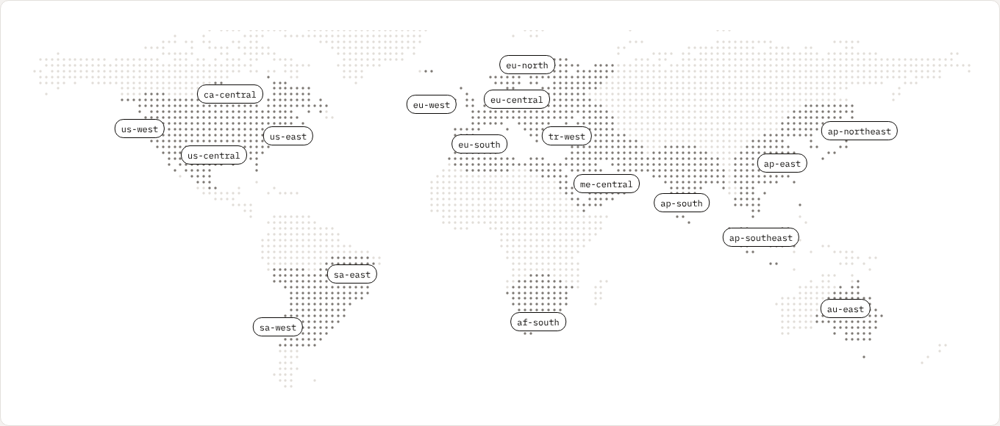

# StatusTick

**Uptime monitoring without false alarms.**

StatusTick checks your product from several regions and confirms a failure before anyone is paged. A small agent inside your network checks private services too. It only makes outbound calls, so you don't open any ports.

Monitors, alerts, incidents and status pages work together in one place.

We're in closed beta and launching in Q1 2027. Join the beta at **[statustick.com](https://statustick.com)**.

### Also from StatusTick

- **[vendor.statustick.com](https://vendor.statustick.com)**: the official status of popular developer services on one page.
- **[healthcheck.wtf](https://healthcheck.wtf)**: real outage stories and what teams learned from them.

Our own status: **[status.statustick.com](https://status.statustick.com)**

### Follow

[LinkedIn](https://www.linkedin.com/company/statustick) · [X](https://x.com/GetStatusTick)

